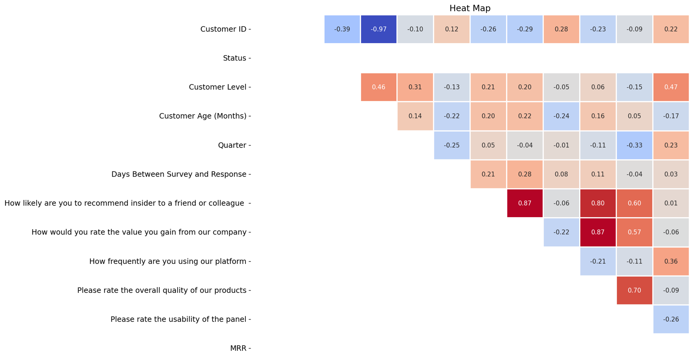
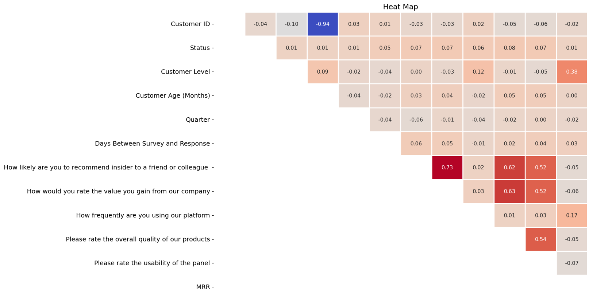

# 📉 Customer Churn Analysis — Insider

This project focuses on analyzing and understanding the **customer churn problem at Insider**.

Customer churn — when users stop using a product or service — is a critical issue for any SaaS company aiming to grow sustainably. In this project, we examined Insider’s datasets to uncover patterns and signals that could help predict and reduce churn.

  

  <b>Status Of Customers </b>

---

## 🎯 Goal

The primary goal of this analysis was to **identify why customers leave** and to generate **actionable insights** for increasing retention and long-term revenue (MRR). We focused on understanding:

- How customer characteristics differ between churned and retained users  
- What behavioral patterns are associated with churn  
- Which specific features or services might influence loyalty  

---

## 🧠 Our Approach

We analyzed multiple datasets provided by Insider, including:

- **Survey responses** from users about usability and satisfaction  
- **Customer profile information** such as industry, level, and region  
- **Engagement metrics** like support requests, product usage, and newsletter interaction  

We then compared churned and retained customers to spot trends, inconsistencies, and opportunities for improvement.

  
  

  <em>Correlation Analysis of Customer Surveys</em> 
  Left: Churned Customers | Right: Not Churn Customers

---

## 💡 Key Insights

- Churned customers tend to be lower-tier clients with less frequent platform usage  
- Even customers who churned didn’t always report dissatisfaction, suggesting silent churn risks  
- Many at-risk users had trouble with data reporting features  
- Timely, targeted engagement and education may help reduce churn

---

## ✅ Outcome

The insights from this analysis can be used to:

- Build better retention strategies  
- Offer more personalized customer support and onboarding  
- Improve satisfaction with key features  
- Prioritize product improvements that align with long-term user value

---

## 🔗 Explore More

  

---
